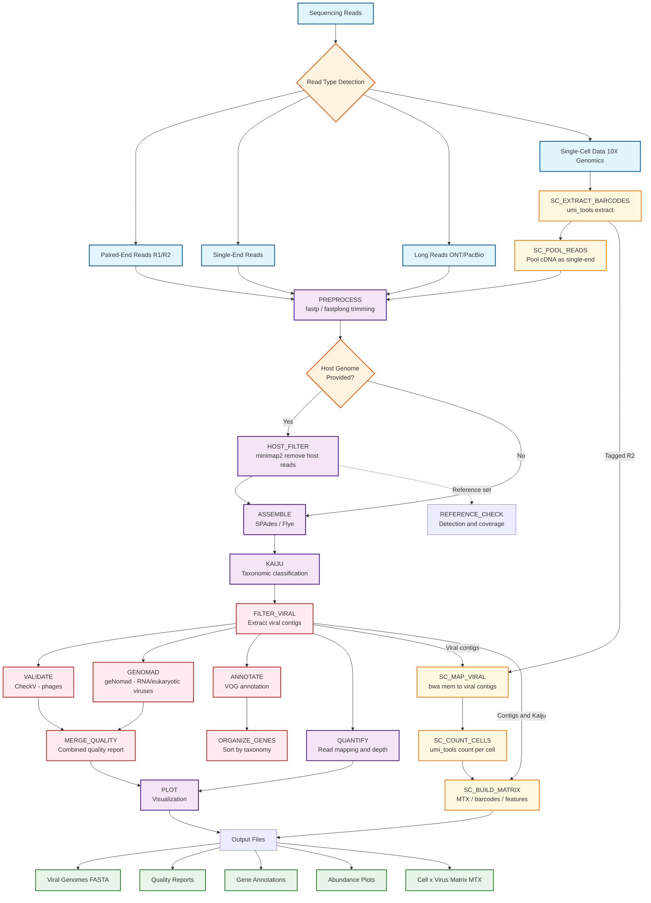

# Viral Genome Assembly Tool - Process Flow Diagram

## Workflow Description

### 1. **Input Processing**
- Supports multiple read types: paired-end, single-end, long reads, and single-cell data
- Automatic read type detection and routing to appropriate preprocessing pipelines

### 2. **Preprocessing**
- **Short Reads**: fastp (QC, automatic adapter detection, trimming)
- **Long Reads**: fastplong (QC, automatic adapter detection, trimming for ONT/PacBio)
- **Single-Cell Pipeline (Pooled Mode)**: Extracts barcodes/UMIs from R1, pools cDNA (R2) as single-end reads for assembly
- Quality filtering with configurable thresholds (default: Phred 20 for short, Phred 7 for long)
- Optional host read filtering using minimap2 against a reference host genome

### 3. **Assembly**
- **Hybrid**: Combines short and long reads using SPAdes + Flye
- **Short-read only**: SPAdes for Illumina data (standard, metaviral, or rnaviral modes)
- **Long-read only**: Flye for ONT/PacBio data
- **RNA mode**: SPAdes `--rnaviral` for transcriptome assembly (RNA-seq and single-cell RNA-seq)

### 4. **Viral Identification**
- Kaiju classification against viral databases (direct contig analysis)
- Filtering based on confidence threshold (default: 0.8)

### 5. **Quality Assessment**
- **CheckV**: Optimal for bacteriophage genomes (completeness, contamination)
- **geNomad**: Optimal for RNA viruses and eukaryotic DNA viruses
- Results automatically merged based on Kaiju taxonomy classification

### 6. **Annotation**
- Gene prediction using Prodigal
- VOG (Viral Orthologous Groups) annotation
- Genes organized by viral taxonomy (family/genus/species)

### 7. **Quantification and Visualization**
- Read mapping to viral contigs (BWA-MEM for short, minimap2 for long)
- Coverage depth analysis
- Abundance plots, quality distribution, taxonomy sunburst, coverage plots

### 8. **Single-Cell Trace-Back**
- Barcoded reads mapped back to discovered viral contigs
- UMI-aware counting per cell per viral contig
- Output: Cell-by-virus MTX matrix compatible with Scanpy/Seurat
- Supports 10x Genomics v1, v2, and v3 chemistries (3' and 5')

## Key Features

- **Modular Design**: Each step can be run independently
- **Configurable**: YAML configuration file for parameter tuning
- **Multi-format Support**: Handles various sequencing technologies
- **Single-cell Ready**: 10x Genomics barcode extraction, pooled assembly, per-cell viral quantification
- **Dual Quality Assessment**: CheckV for phages, geNomad for RNA/eukaryotic viruses
- **Quality Focused**: Multiple validation and QC steps
- **Scalable**: Nextflow DSL2 with Docker/Singularity support
