# Viral Genome Assembly Tool - Process Flow Diagram

```mermaid
flowchart TD
    %% Input Data
    A[Sequencing Reads] --> B{Read Type Detection}
    B --> C[Paired-End Reads<br/>R1 + R2]
    B --> D[Single-End Reads]
    B --> E[Long Reads<br/>ONT/PacBio]
    B --> F[Single-Cell Data<br/>10X Genomics]
    
    %% Preprocessing Branch
    C --> G[Preprocessing Pipeline]
    D --> G
    E --> G
    F --> H[Single-Cell Preprocessing]
    
    %% Standard Preprocessing
    G --> I{Read Type}
    I -->|Short Reads| J[Quality Control & Adapter Trimming<br/>fastp<br/>Automatic Adapter Detection]
    I -->|Long Reads| J2[Quality Control & Adapter Trimming<br/>fastplong<br/>Automatic Adapter Detection]
    J --> K{Quality Threshold<br/>>=20 Phred Short}
    J2 --> K2{Quality Threshold<br/>>=7 Phred Long}
    K -->|Pass| L[Error Correction<br/>SPAdes]
    K -->|Fail| M[Discard Reads]
    K2 -->|Pass| L
    K2 -->|Fail| M
    L --> N[Preprocessed Reads]
    
    %% Single-Cell Preprocessing (Pooled Mode)
    H --> O[Extract R2 cDNA Reads<br/>from Paired-End Input]
    O --> P[Pool R2 Reads<br/>as Single-End]
    P --> Q[Enable RNA Mode<br/>Automatically]
    Q --> T[Standard Preprocessing<br/>fastp trimming]
    
    %% Assembly Branch
    N --> U{Assembly Strategy}
    T --> U
    U --> V[Hybrid Assembly<br/>Short + Long reads]
    U --> W[Short-Read Only<br/>SPAdes]
    U --> X[Long-Read Only<br/>Flye]
    U --> Y[RNA/Single-Cell Mode<br/>SPAdes --rnaviral]
    
    %% Assembly Methods
    V --> Z[SPAdes + Flye<br/>Combined]
    W --> AA[SPAdes Assembly<br/>Illumina reads]
    X --> BB[Flye Assembly<br/>ONT/PacBio reads]
    Y --> CC[SPAdes RNA-Viral<br/>Transcriptome assembly]
    
    %% Assembly Output
    Z --> DD[Assembled Contigs]
    AA --> DD
    BB --> DD
    CC --> DD
    
    %% Viral Identification
    DD --> EE[Viral Contig Identification]
    EE --> FF[Kaiju Classification<br/>Viral Database<br/>Direct Contig Analysis]
    FF --> GG[Confidence Filtering<br/>Threshold >=0.8]
    GG --> HH[Viral Contigs<br/>Filtered]
    
    %% Gene Prediction & Annotation
    HH --> II[Gene Prediction<br/>Prodigal]
    II --> JJ[VOG Annotation<br/>Viral Orthologous Groups]
    JJ --> KK[Functional Annotation<br/>Gene Functions]
    
    %% Validation & Quality Control
    KK --> LL[Assembly Validation]
    LL --> MM[CheckV<br/>Viral Genome Quality]
    MM --> NN[Assembly Statistics]
    NN --> OO[Quality Metrics]
    
    %% Quantification (if applicable)
    OO --> PP{Quantification<br/>Required?}
    PP -->|Yes| QQ[Read Mapping<br/>BWA-MEM]
    PP -->|No| RR[Final Results]
    QQ --> SS[Coverage Analysis<br/>Depth Calculation]
    SS --> RR
    
    %% Output Generation
    RR --> TT[Output Files]
    TT --> UU[Viral Genomes<br/>FASTA]
    TT --> VV[Gene Annotations<br/>GFF3]
    TT --> WW[Quality Reports<br/>HTML/PDF]
    TT --> XX[Assembly Statistics<br/>TSV/CSV]
    
    %% Configuration & Parameters
    YY[Configuration File<br/>default_config.yaml] --> G
    YY --> U
    YY --> EE
    YY --> LL
    
    %% Styling
    classDef input fill:#e1f5fe,stroke:#01579b,stroke-width:2px
    classDef process fill:#f3e5f5,stroke:#4a148c,stroke-width:2px
    classDef decision fill:#fff3e0,stroke:#e65100,stroke-width:2px
    classDef output fill:#e8f5e8,stroke:#2e7d32,stroke-width:2px
    classDef viral fill:#ffebee,stroke:#c62828,stroke-width:2px
    
    class A,C,D,E,F input
    class G,H,J,J2,L,O,P,Q,T process
    class B,I,K,K2,U,PP decision
    class UU,VV,WW,XX output
    class EE,FF,GG,HH,II,JJ,KK viral
```

## Workflow Description

### 1. **Input Processing**
- Supports multiple read types: paired-end, single-end, long reads, and single-cell data
- Automatic read type detection and routing to appropriate preprocessing pipelines

### 2. **Preprocessing**
- **Short Reads**: fastp (QC + automatic adapter detection + trimming) → Error Correction
- **Long Reads**: fastplong (QC + automatic adapter detection + trimming for ONT/PacBio) → Error Correction
- **Single-Cell Pipeline (Pooled Mode)**: Extracts R2 (cDNA) reads from paired-end input → Pools as single-end → Enables RNA mode automatically → Standard fastp preprocessing
- Quality filtering with configurable thresholds (default: Phred ≥20 for short, ≥7 for long)
- Both fastp and fastplong automatically detect and trim adapters without requiring adapter sequence files

### 3. **Assembly**
- **Hybrid**: Combines short and long reads using SPAdes + Flye
- **Short-read only**: SPAdes for Illumina data (standard, metaviral, or sc modes)
- **Long-read only**: Flye for ONT/PacBio data
- **RNA mode**: SPAdes `--rnaviral` for transcriptome assembly (RNA-seq and single-cell RNA-seq)
- **Single-cell mode**: Automatically enables RNA mode and uses SPAdes `--rnaviral` without genomic single-cell flag (pooled assembly)

### 4. **Viral Identification**
- Kaiju classification against viral databases (direct contig analysis)
- Efficient identification from assembled contigs (no read-based filtering)
- Filtering based on confidence threshold (default: ≥0.8)

### 5. **Annotation**
- Gene prediction using Prodigal
- VOG (Viral Orthologous Groups) annotation
- Functional classification of predicted genes

### 6. **Validation & Quality Control**
- CheckV for viral genome quality assessment
- Coverage analysis and quantification

### 7. **Output Generation**
- Viral genomes in FASTA format
- Gene annotations in GFF3 format
- Quality reports and assembly statistics
- Comprehensive HTML/PDF reports

## Key Features

- **Modular Design**: Each step can be run independently
- **Configurable**: YAML configuration file for parameter tuning
- **Multi-format Support**: Handles various sequencing technologies
- **Single-cell Ready**: Pooled single-cell RNA-seq support (R2 cDNA assembly with SPAdes --rnaviral)
- **Quality Focused**: Multiple validation and QC steps
- **Scalable**: Memory-efficient mode for large datasets
